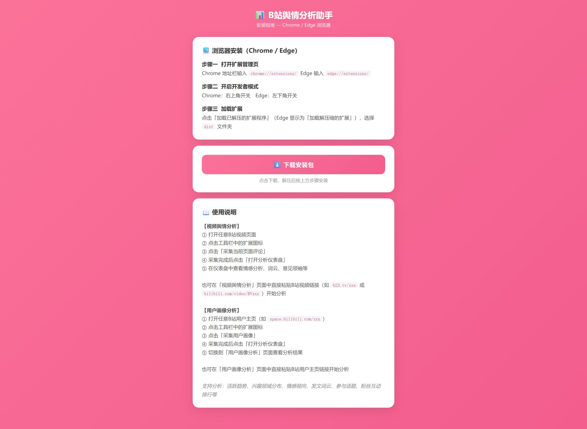
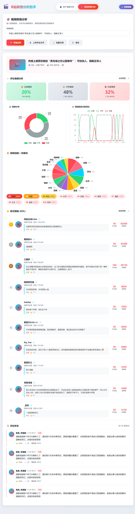
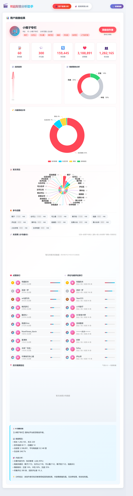
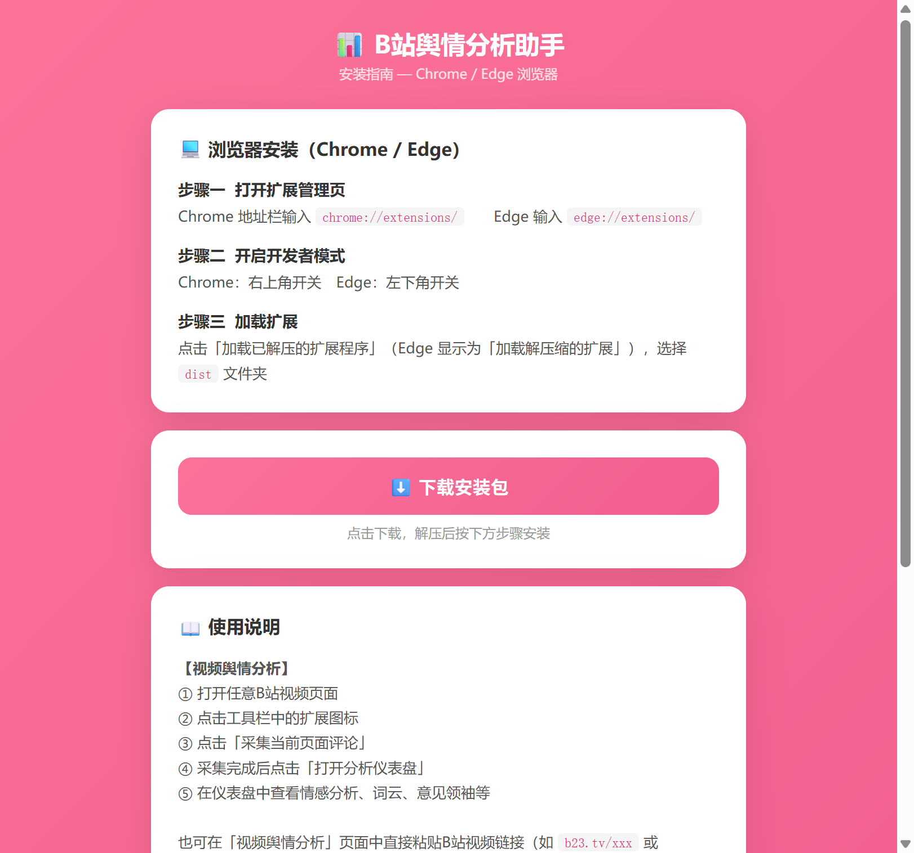
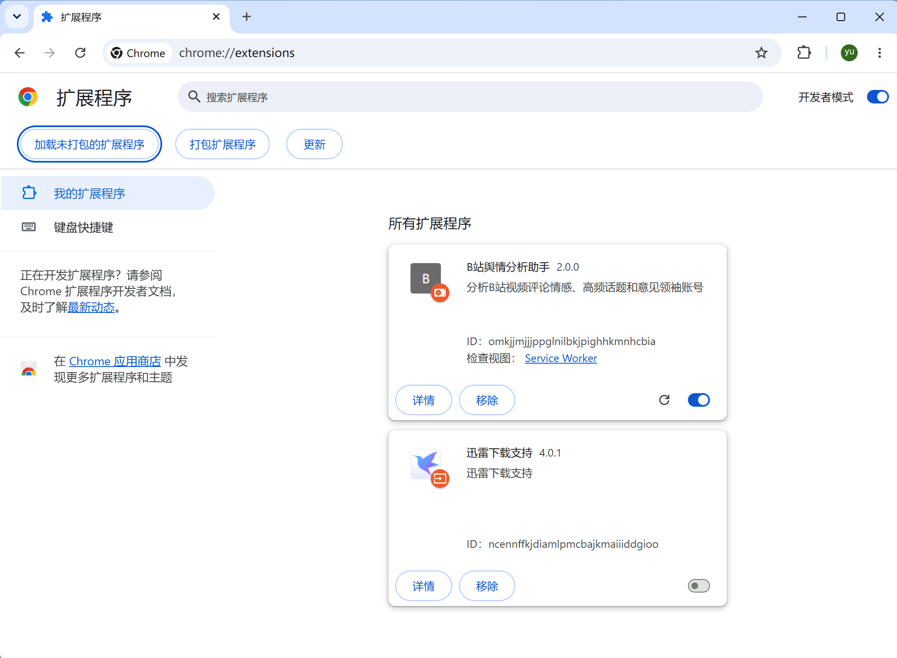
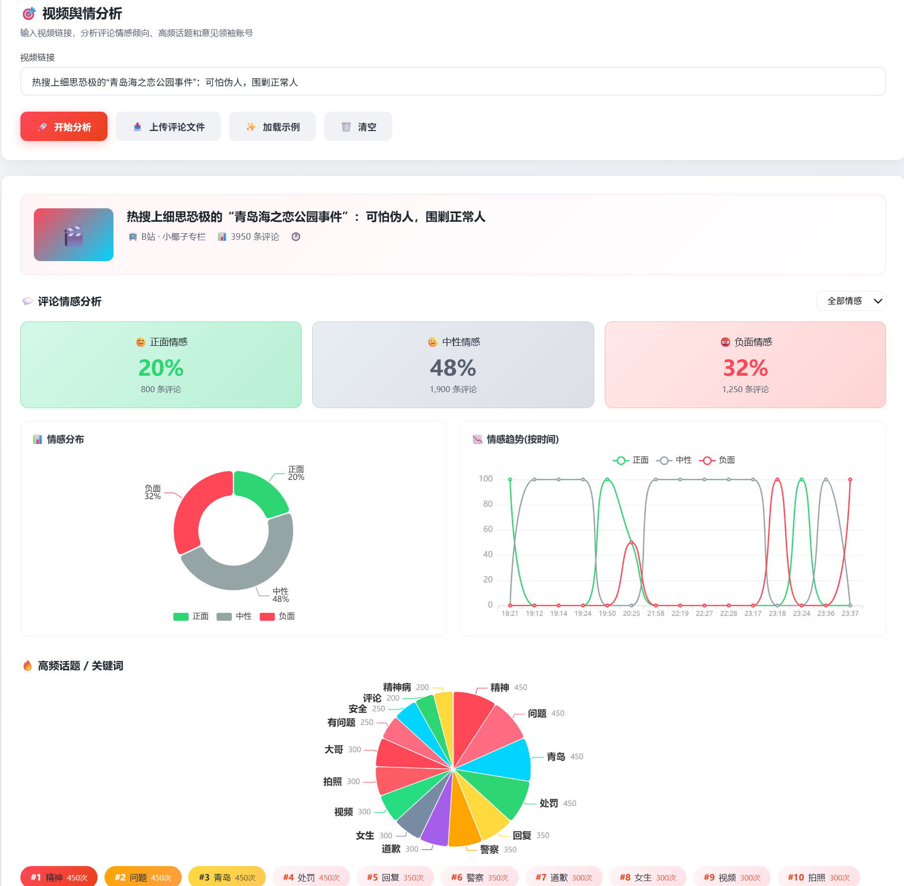
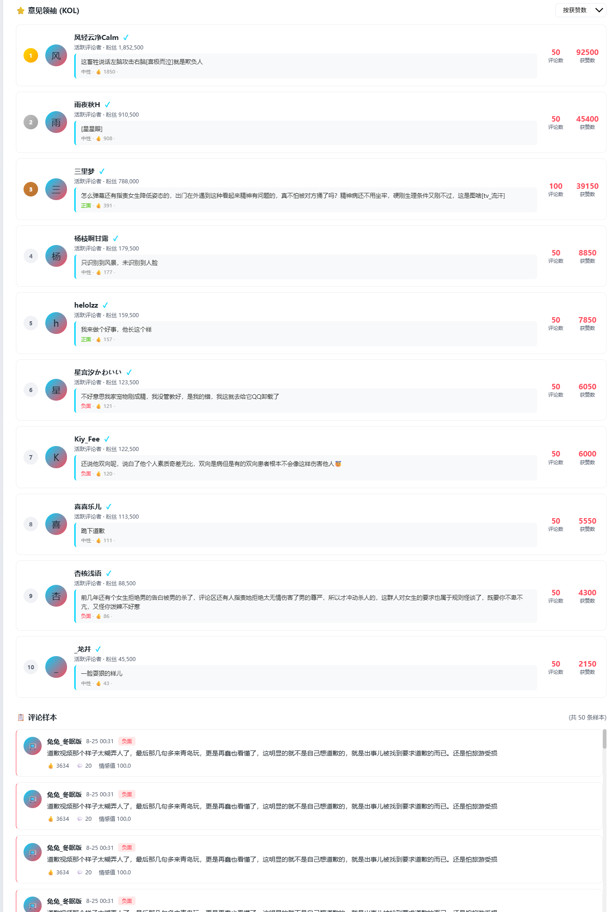
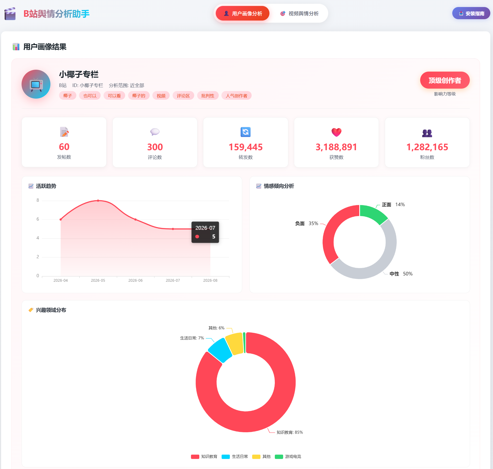
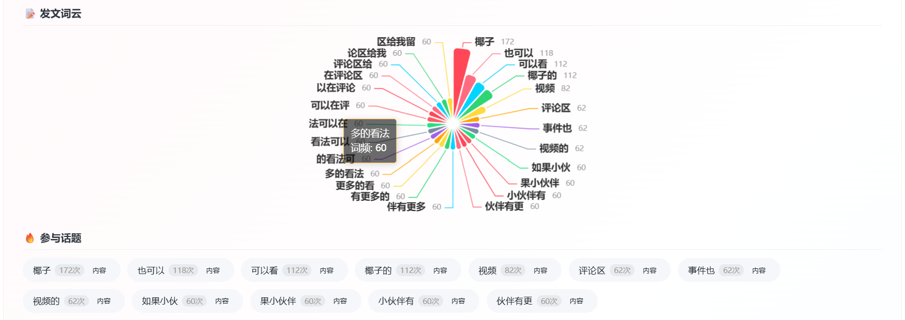
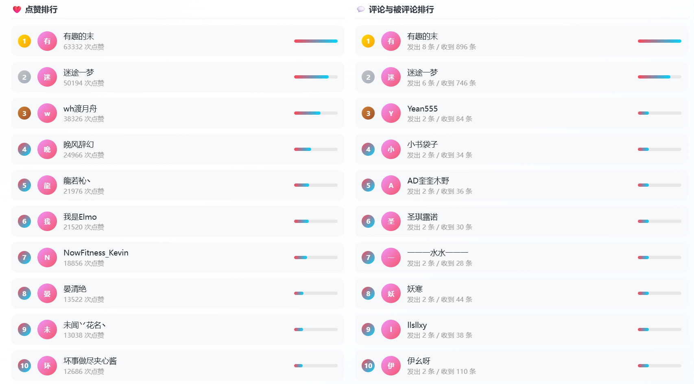

# 📊 B站舆情分析助手

> 一个用于分析 Bilibili（B站）视频评论情感、高频话题、意见领袖账号和用户画像的浏览器扩展工具。



## 功能概览

### 视频舆情分析

- **评论采集**：在B站视频页面一键采集评论，或通过输入视频链接远程获取
- **情感分析**：基于中文情感词典，自动识别正面/负面/中性评论
- **情感趋势**：按时间维度展示评论情感变化曲线
- **词云图**：提取评论高频关键词，可视化呈现舆论焦点
- **意见领袖（KOL）识别**：按点赞数和评论数排序，识别影响力用户
- **评论样本**：展示代表性评论，按点赞数降序排列



### 用户画像分析

- **用户信息采集**：在B站用户主页一键采集，或通过输入主页链接远程获取
- **活跃趋势**：按月份统计发文量，展示活跃度变化
- **兴趣领域分布**：基于150+关键词分类，识别用户内容领域偏好
- **情感倾向分析**：综合视频标题和评论，分析用户整体情感倾向
- **发文词云**：提取视频标题和描述关键词生成词云
- **参与话题**：展示用户参与的热门话题标签
- **粉丝互动排行**：按点赞数和评论数生成粉丝排行榜
- **地域分布**：基于评论数据的用户地域分布地图



## 技术架构

| 模块 | 技术栈 |
|------|--------|
| 前端框架 | 原生 JavaScript + ECharts 5 |
| 构建工具 | Vite 5 |
| 浏览器扩展 | Chrome Extension Manifest V3 |
| 情感分析 | 本地中文情感词典 + 规则匹配（无外部 API 依赖） |
| 地图可视化 | ECharts geo + DataV 中国地图 GeoJSON |
| 安装网站 | 静态 HTML 部署于 Vercel |
| 安装包托管 | GitHub Releases |

## 项目结构

```
yuqing-trae/
├── src/                        # 前端源码
│   ├── main.js                 # 主应用逻辑（仪表盘、分析渲染）
│   ├── charts.js               # ECharts 图表渲染模块
│   ├── sentiment.js            # 情感分析与关键词提取
│   ├── mockData.js              # 平台配置与数据模型
│   ├── style.css               # 全局样式
│   └── chinaMap.js             # 本地中国地图数据（备用）
├── public/                      # 扩展静态资源
│   ├── manifest.json           # 扩展配置（Manifest V3）
│   ├── background.js           # Service Worker（后台数据处理）
│   ├── popup.html / popup.js   # 扩展弹窗
│   ├── install.html / install.js  # 安装引导页面
│   ├── content/
│   │   ├── bilibili.js         # 视频评论采集脚本
│   │   └── user_profile.js     # 用户画像采集脚本
│   ├── icons/                  # 扩展图标
│   └── 一键安装.bat             # Windows 快捷安装脚本
├── website/                     # 安装网站（Vercel 部署）
│   ├── index.html              # 首页
│   ├── install.html            # 安装引导页
│   ├── vercel.json             # Vercel 部署配置
│   └── bili-yuqing-assistant.zip  # 扩展安装包
├── screenshots/                 # 项目截图
├── .github/workflows/
│   ├── release.yml             # 自动创建 GitHub Release
│   └── pages.yml               # GitHub Pages 部署
├── dist/                       # 构建输出（扩展加载目录）
├── vite.config.js              # Vite 构建配置
└── package.json
```

## 安装方式

### 方式一：安装网站下载（推荐）



1. 访问安装网站：[https://bili-yuqing-assistant.vercel.app](https://bili-yuqing-assistant.vercel.app)
2. 点击「下载安装包」，下载 `bili-yuqing-assistant.zip`
3. 解压到任意文件夹
4. 打开 `chrome://extensions/`（Chrome）或 `edge://extensions/`（Edge）
5. 开启「开发者模式」
6. 点击「加载已解压的扩展程序」，选择解压后的 `bili-yuqing-assistant` 文件夹

### 方式二：开发者模式加载



1. 克隆仓库：`git clone https://github.com/fangyuuu888-bot/bili-yuqing-assistant.git`
2. 安装依赖：`npm install`
3. 构建项目：`npm run build`
4. 在 `dist/` 目录加载扩展

## 使用指南

### 视频舆情分析


1. 打开任意 B站视频页面，点击浏览器右上角扩展图标
2. 点击「采集评论」按钮，自动采集当前视频评论
3. 或在「视频舆情分析」页面输入视频链接，点击「开始分析」



4. 查看情感分析、词云、KOL 排行等分析结果



### 用户画像分析



1. 打开 B站用户主页，点击扩展图标
2. 点击「采集用户画像」按钮，自动采集用户信息和视频列表
3. 或在「用户画像分析」页面输入用户主页链接，点击「开始分析」



4. 查看活跃趋势、兴趣分布、情感倾向、词云等分析结果



## API 端点说明

本项目使用 B站公开 API 获取数据，采用多端点回退策略确保数据完整性：

| 用途 | 端点 | 备注 |
|------|------|------|
| 用户信息 | `x/web-interface/card` | 不需要 WBI 签名 |
| 用户信息（备用） | `x/space/wbi/acc/info` | 需要 WBI 签名 |
| 粉丝数据 | `x/relation/stat` | — |
| 视频列表 | `x/space/wbi/arc/search` | 需要 WBI 签名，分页获取 |
| 视频列表（备用1） | `x/space/arc/search` | 旧版端点 |
| 视频列表（备用2） | `x/polymer/web-dynamic/v1/feed/space` | 动态流 |
| 视频详情 | `x/web-interface/view` | 补充播放量、点赞等 |
| 评论数据 | `x/v2/reply/main` | 多页获取，最多 300 条 |

## 本地开发

```bash
# 安装依赖
npm install

# 启动开发服务器
npm run dev

# 构建扩展
npm run build

# 构建产物在 dist/ 目录
# 在 Chrome/Edge 中加载 dist/ 目录即可
```

## 部署

### 安装网站部署（Vercel）

1. Fork 仓库到你的 GitHub
2. 在 [Vercel](https://vercel.com) 导入仓库
3. 设置 Root Directory 为 `website`
4. 设置 Build Command 为 `exit 0`（纯静态站点，无需构建）
5. 部署完成后获得安装网站地址

### 安装包自动发布（GitHub Actions）

仓库包含 `release.yml` 工作流，每次推送代码到 `main` 分支时会自动：
1. 将 `dist/` 目录打包为 `bili-yuqing-assistant.zip`
2. 删除旧的 `latest` Release
3. 创建新 Release 并上传安装包

## 技术亮点

- **零外部依赖情感分析**：内置 150+ 正面/负面情感词典，完全本地运行，无需调用 AI API
- **多端点回退策略**：针对 B站 API 的 WBI 签名限制，采用三端点分页 + BV 去重，确保视频数据采集完整性
- **DOM 优先采集**：用户画像采集采用 DOM 提取优先、API 补充的策略，绕过未登录状态下的 API 限制
- **三级文本清理**：采集层 → 分析层 → 渲染层三层过滤评论中的图片 URL 和文件名残留
- **Manifest V3**：使用最新的 Chrome 扩展标准，Service Worker 后台处理

## 浏览器兼容性

- Chrome 88+
- Edge 88+
- 其他基于 Chromium 的浏览器

## 许可证

MIT License

## 相关链接

- 安装网站：[https://bili-yuqing-assistant.vercel.app](https://bili-yuqing-assistant.vercel.app)
- GitHub 仓库：[https://github.com/fangyuuu888-bot/bili-yuqing-assistant](https://github.com/fangyuuu888-bot/bili-yuqing-assistant)
- 下载安装包：[GitHub Releases](https://github.com/fangyuuu888-bot/bili-yuqing-assistant/releases/latest)
